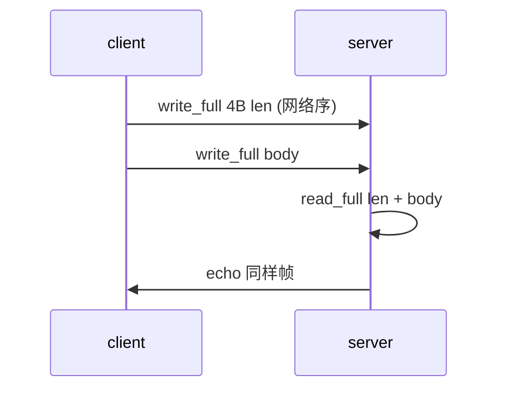
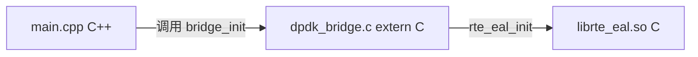

---
tags:
  - C
  - C++
  - 学习路径
  - 实践
title: C/C++ 主线实践验收
description: 四阶段自测：长度前缀 echo、readelf、extern C、Rule-of-5 fd、ASan、perf
date: 2026/05/21
---

# C/C++ 主线实践验收

[[精通 C-C++ 学习路径#4. 实践验收（自测）]] 里列了四组 **小练习**；本篇给出 **可编译、可验收** 的最小实现与命令。每阶段 **做一遍即可**，不必求全。

**环境**：Linux 或 macOS；阶段 1 用 **GCC/Clang + make**；阶段 3–4 需 **C++17**。阶段 2 的 DPDK 示例在 **未装 DPDK SDK** 时可用桩代码验收 **链接边界**。

**配套源码**（可选克隆后本地编译）：仓库 `labs/c-cpp-mastery/`。

---

## 1. 读完能带走什么

- 阶段 1：能写 **读满/写满** 循环 + **长度前缀** echo，并用 `readelf` 读交叉编译 ELF。  
- 阶段 2：能用 **`extern "C"`** 包 C API；能对照 MISRA 子集 **Review 自己代码**。  
- 阶段 3：能实现 **Rule-of-5 的 fd RAII**；会用 `nm -C` 看 **虚表符号**。  
- 阶段 4：能 **ASan + GoogleTest** 跑通；会用 `perf record` 出 **火焰图**。

---

## 2. 阶段 1：POSIX I/O + 链接阅读

### 2.1 数据路径



与 [[C 字符串与 POSIX I/O 精读#6. 长度前缀协议（防粘包）]]、[[网络与DPDK/网络编程/TCP 连接、粘包与常见陷阱]] 同一套 **帧格式**：`uint32_t len`（大端）+ payload，且 **len 设上限** 防 OOM。

### 2.2 `read_full` / `write_full`

```c
/* io_utils.h */
#pragma once
#include <stddef.h>
#include <sys/types.h>

ssize_t read_full(int fd, void *buf, size_t count);
ssize_t write_full(int fd, const void *buf, size_t count);
```

```c
/* io_utils.c — 要点：EINTR 重试；read 遇 EOF 返回已读字节数 */
#include "io_utils.h"
#include <errno.h>
#include <unistd.h>

ssize_t read_full(int fd, void *buf, size_t count)
{
    size_t off = 0;
    while (off < count) {
        ssize_t n = read(fd, (char *)buf + off, count - off);
        if (n < 0) {
            if (errno == EINTR)
                continue;
            return -1;
        }
        if (n == 0)
            return (ssize_t)off;
        off += (size_t)n;
    }
    return (ssize_t)count;
}

ssize_t write_full(int fd, const void *buf, size_t count)
{
    size_t off = 0;
    while (off < count) {
        ssize_t n = write(fd, (const char *)buf + off, count - off);
        if (n < 0) {
            if (errno == EINTR)
                continue;
            return -1;
        }
        off += (size_t)n;
    }
    return (ssize_t)count;
}
```

### 2.3 长度前缀 echo（验收）

**编译**（在 `labs/c-cpp-mastery/stage1-len-echo/` 或自建目录）：

```bash
make
./len_echo_server &          # 默认 127.0.0.1:9999
./len_echo_client "hello"
# 期望 stdout: hello
kill %1
```

**服务端核心逻辑**（读一帧、原样写回）：

```c
#define MAX_BODY (64 * 1024)

uint32_t net_len;
if (read_full(fd, &net_len, 4) != 4)
    break;
uint32_t len = ntohl(net_len);
if (len == 0 || len > MAX_BODY)
    break;

char *body = malloc(len);
if (!body)
    break;
if (read_full(fd, body, len) != (ssize_t)len) {
    free(body);
    break;
}
write_full(fd, &net_len, 4);
write_full(fd, body, len);
free(body);
```

| 检查项 | 通过标准 |
|--------|----------|
| 短写 | `strace -e write` 可见多次 `write` 仍发完 |
| 粘包 | 连续发 3 帧，client 逐帧收到 |
| 超长 len | server 拒绝 `len > MAX_BODY` |

### 2.4 `readelf` 读交叉编译产物

与 [[C 编译链接与 ABI]]、[[linux/学习路径/应用交叉编译实战指南]] 衔接。

```bash
# 例：Buildroot / 厂商 SDK 产出的 ELF
readelf -h ./app              # Class: ELF32/64, Machine: ARM/AArch64/RISC-V
readelf -l ./app | head       # INTERP、LOAD 段
readelf -d ./app | grep NEEDED   # 动态依赖 libc.so
readelf -s ./app | grep UND   # 未定义符号 → 链接时要从哪找
```

| 字段 | 你要确认什么 |
|------|--------------|
| **Class / Data** | 32/64 位、大小端与目标板一致 |
| **Machine** | 与 CPU 架构一致 |
| **NEEDED** | 目标根文件系统里是否有对应 `.so` |
| **UND** | 缺库时链接期 vs 运行期报错 |

**验收**：能口头解释「**链接错误 undefined reference**」与「**运行 ./app: error while loading shared libraries**」分别发生在哪一阶段。

---

## 3. 阶段 2：C/C++ 边界 + 规范 Review

### 3.1 `extern "C"` 包 DPDK 初始化（模式）

DPDK 的 `rte_eal_init` 等是 **C API**；C++ 主程序需 **C 链接** 且 **头文件在 `extern "C"` 块内**。见 [[C 与 C++ 混用]]、[[C++ 封装 DPDK 数据面]]。



**无 DPDK 时的桩**（只验链接与命名）：

```c
/* dpdk_bridge.c */
#include "dpdk_bridge.h"
#include <stdio.h>

int dpdk_eal_init(int argc, char **argv)
{
    (void)argc;
    (void)argv;
    fprintf(stderr, "stub: dpdk_eal_init ok\n");
    return 0;
}
```

```cpp
/* main.cpp */
#include "dpdk_bridge.h"
#include <iostream>

int main(int argc, char **argv)
{
    if (dpdk_eal_init(argc, argv) != 0)
        return 1;
    std::cout << "C++ after EAL\n";
    return 0;
}
```

```bash
g++ -std=c++17 main.cpp dpdk_bridge.c -o app && ./app
```

有 SDK 时：把桩换成真实 `#include <rte_eal.h>`，Makefile 加 `pkg-config --libs libdpdk` 即可。

### 3.2 MISRA 子集 Review（10 条）

对照 [[MISRA C 与 CERT C 编码规范对照]]、[[嵌入式代码评审清单]]，对自己 **阶段 1 echo 代码** 过一遍：

| # | 规则 | 你的代码应… |
|---|------|-------------|
| 1 | 外部输入有界 | `len <= MAX_BODY` |
| 2 | 检查返回值 | `read_full`/`malloc` 失败分支 |
| 3 | 无 `strcpy` 拼协议 | 用长度前缀 |
| 4 | 单出口释放资源 | `free(body)` 各路径覆盖 |
| 5 | 无隐式窄化 | `size_t` 与 `uint32_t` 转换显式 |
| 6 | 宏全括号 | 若用宏，参数加括号 |
| 7 | switch 有 default | 状态机分支完整 |
| 8 | 避免空 `if` 体 | 用 `{}` 或注释 |
| 9 | 函数圈复杂度 | 单函数 < 50 行可拆 |
| 10 | 文档化假设 | 文件头写帧格式与端口 |

**验收**：在 PR 或笔记里贴 **10 条自查表**，标 ✅/❌ 与改法。

---

## 4. 阶段 3：C++ 对象模型 + ABI 符号

### 4.1 Rule-of-5：`FdGuard`

管理 **POSIX fd** 的 RAII，与 [[C++ 对象模型与 Rule of Zero-Three-Five]]、[[RAII]] 一致。

```cpp
/* fd_guard.hpp */
#pragma once
#include <unistd.h>
#include <utility>

class FdGuard {
public:
    explicit FdGuard(int fd = -1) noexcept : fd_(fd) {}
    ~FdGuard() { reset(); }

    FdGuard(const FdGuard &) = delete;
    FdGuard &operator=(const FdGuard &) = delete;

    FdGuard(FdGuard &&other) noexcept : fd_(other.fd_) { other.fd_ = -1; }
    FdGuard &operator=(FdGuard &&other) noexcept {
        if (this != &other) {
            reset();
            fd_ = other.fd_;
            other.fd_ = -1;
        }
        return *this;
    }

    int get() const noexcept { return fd_; }
    int release() noexcept {
        int tmp = fd_;
        fd_ = -1;
        return tmp;
    }
    void reset(int fd = -1) {
        if (fd_ >= 0)
            close(fd_);
        fd_ = fd;
    }

private:
    int fd_;
};
```

**验收**：

```cpp
{
    FdGuard g(open("README", O_RDONLY));
    FdGuard h(std::move(g));   /* 移动后 g 无效 */
}   /* 作用域结束自动 close，无泄漏 */
```

用 [[C/C++ Sanitizer 与单元测试入门]] 的 ASan 编译运行；`valgrind --leak-check=full` 亦可。

### 4.2 `nm -C` 看虚类

```cpp
/* vtable_demo.cpp */
struct Base {
    virtual ~Base() = default;
    virtual int foo() const { return 1; }
};
struct Derived : Base {
    int foo() const override { return 2; }
};
int main() { Derived d; return d.foo(); }
```

```bash
g++ -std=c++17 -g vtable_demo.cpp -o vtable_demo
nm -C vtable_demo | grep -E 'vtable|Base|Derived'
```

| 符号 | 含义 |
|------|------|
| `vtable for Derived` | 虚表实体 |
| `typeinfo for Derived` | RTTI |
| `Derived::foo()` | 虚函数实现 |

与 [[C++ ABI 深读]] 对照；coredump 里找 vtable 见 [[coredump 分析基础]]。

---

## 5. 阶段 4：测对 + 写快

### 5.1 ASan + GoogleTest

对 **阶段 3 `FdGuard`** 或 **阶段 1 解析函数** 写单测：

```bash
export CXX=clang++
export SAN="-fsanitize=address,undefined -fno-omit-frame-pointer -g -O1"
$CXX $SAN -std=c++17 fd_guard_test.cpp -lgtest -lgtest_main -pthread -o test
./test
```

故意写错（移动后 double-close）应 **ASan 报错**。细节见 [[C/C++ Sanitizer 与单元测试入门]]、[[系统调试/ASan 与 Valgrind 桌面验证]]。

### 5.2 perf 火焰图（找一热点）

对 **CPU 密集小函数**（如 [[排序算法大全与 C++ 实现]] 里某排序 $n=10^6$）：

```bash
perf record -g --call-graph dwarf -F 997 ./sort_bench
perf script | stackcollapse-perf.pl | flamegraph.pl > flame.svg
```

读图方法：[[C/C++ 性能优化方法论]]、[[perf 与火焰图读 C++ 热点]]、[[排障 SOP：日志、perf 与反汇编]]。

**验收**：能指出 **最宽栈顶函数** 并说一句「下一步优化是否值得」（算法 vs 微优化）。

---

## 6. 四阶段总验收表

| 阶段 | 交付物 | 最低标准 |
|------|--------|----------|
| 1 | `len_echo_*` + readelf 笔记 | client/server 互通；能读 ELF header |
| 2 | `dpdk_bridge` 或等价 + MISRA 10 条 | C++ 链 C 无 mangling 冲突 |
| 3 | `FdGuard` + `nm` 截图/粘贴 | 移动语义正确；能看到 vtable |
| 4 | ASan 单测 + 一张 flame.svg | 测试绿；说清一个热点 |

---

## 7. 相关链接

- [[精通 C-C++ 学习路径]]
- [[C 字符串与 POSIX I/O 精读]]
- [[C 与 C++ 混用]]
- [[C++ 对象模型与 Rule of Zero-Three-Five]]
- [[C/C++ Sanitizer 与单元测试入门]]
- [[C/C++ 性能优化方法论]]

---

*完成某一阶段后，可在 [[成长路径/index#八点五、精通 C / C++（系统向主线）]] 旁注实践日期；新问题仍记 [[学习疑问/疑问记录]]。*
