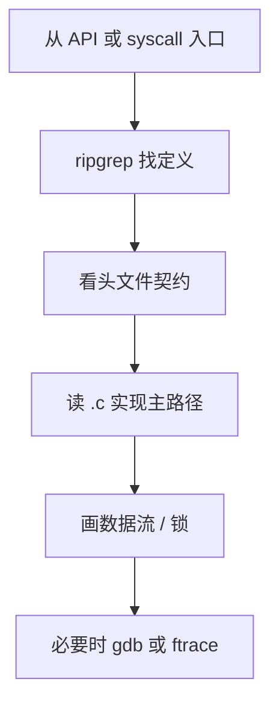

---
tags:
  - C
  - C++
  - 源码
  - 调试
title: 阅读 C 与 C++ 源码的方法
description: glibc、Linux 内核与 DPDK 代码的阅读顺序、工具与心智模型
date: 2026/05/21
---

# 阅读 C 与 C++ 源码的方法

「精通」离不开 **读别人的代码**。本篇给出 **glibc / musl、Linux 内核、DPDK** 三类源码怎么切入、用什么工具、如何与 [[C 内存模型与未定义行为]]、[[C++ ABI 深读]] 对照。

---

## 1. 读完能带走什么

- 一套 **从调用点向下钻** 的固定流程。  
- 内核 **list_head**、DPDK **rte_ring** 各读哪几个文件。  
- 工具：**cscope / ripgrep / gdb / bootlin/elixir**。

---

## 2. 通用流程



| 步骤 | 动作 |
|------|------|
| 1 | 明确 **一个问题**（如「pipe 缓冲区多大」） |
| 2 | `rg` / cscope 找 **symbol** |
| 3 | 读 **头文件注释** 与结构体 |
| 4 | 跟 **happy path**，跳过 `#ifdef` 冷门分支 |
| 5 | 记 **不变量**（谁持锁、谁 free） |
| 6 | 与 **man page / TRM** 交叉验证 |

---

## 3. 用户态 C：glibc / musl

### 3.1 获取源码

```bash
# Debian/Ubuntu
apt source libc6
# 或 LXR / bootlin 在线浏览 glibc
```

### 3.2 示例：`read` 路径

| 层级 | 位置（示意） |
|------|--------------|
| 入口 | `read()` → `__libc_read` |
| 内核 | `SYSCALL_DEFINE3(read, ...)` |

对照 [[C 字符串与 POSIX I/O 精读]]：部分读写、EINTR 在 glibc 是否封装。

### 3.3 阅读技巧

- **宏多**：先找 **未宏展开** 的 `.c` 实现。  
- **alias / weak**：注意 `weak_alias`。  
- **线程安全**：找 `LLL_LOCK` 等；对照 [[C++多线程与多进程编程]]。

---

## 4. Linux 内核

### 4.1 在线与本地

| 工具 | 用途 |
|------|------|
| [elixir.bootlin.com](https://elixir.bootlin.com) | 按版本浏览、交叉引用 |
| 本地内核树 | 与 **运行中 `uname -r`** 版本尽量一致 |
| **`scripts/tags`** / cscope | 生成索引 |

### 4.2 示例：`list_head` 双向链表

```c
/* include/linux/list.h */
struct list_head {
    struct list_head *next, *prev;
};

static inline void __list_add(...);
```


| 读法 | 说明 |
|------|------|
| 先 **inline 插入/删除** | `list_add` / `list_del` |
| 再 **container_of** | 从链表项得宿主 struct |
| 找 **真实用户** | `rg "list_add" drivers/` |

与 [[RCU 读拷贝更新机制详解]]、[[内核同步机制总览]] 结合：链表遍历何时要 RCU 读侧锁。

### 4.3 驱动阅读顺序

1. **匹配**：`of_match_table` / `id_table`  
2. **probe**：资源获取、`devm_*`  
3. **ops**：`read/write/ioctl` 或 **irq handler**  
4. **remove**：与 probe 对称  

见 [[platform 驱动完整案例]]、[[Linux 内核模块开发实战]]。

---

## 5. DPDK

### 5.1 树结构

| 目录 | 内容 |
|------|------|
| `lib/eal` | 初始化、大页、lcore |
| `lib/mempool` | rte_mempool |
| `lib/mbuf` | rte_mbuf |
| `drivers/net/*` | PMD |

与 [[DPDK 内存与子系统]]、[[DPDK 教程 2：mbuf、mempool、ethdev 的数据路径]] 对照。

### 5.2 示例：从 `rte_eth_rx_burst` 往下

1. `lib/ethdev/rte_ethdev.h` — API 与 **burst 语义**  
2. `eth_dev->rx_pkt_burst` — 函数指针  
3. 具体 PMD `ixgbe_recv_pkts` 等 — **硬件路径**  

### 5.3 注意

- **宏与 inline** 极多；用 **预处理器展开** 或读 **Programmer's Guide** 先建立模型。  
- **per-lcore** 变量用 `RTE_PER_LCORE`；见 [[per-CPU 与 per-core 数据结构]]。

---

## 6. C++ 源码（LLVM / 项目内）

| 技巧 | 说明 |
|------|------|
| **demangle** | `c++filt`、gdb `set print asm-demangle on` |
| **模板** | 从 **显式实例化** 或 **特化** 入手，少追完整推导 |
| **ABI** | 虚调用看 vtable；[[C++ ABI 深读]] |

---

## 7. 调试辅助

| 场景 | 工具 |
|------|------|
| 用户态 | gdb `break` / `step` / `disassemble` |
| 内核 | ftrace、`printk`、dynamic debug |
| 性能 | perf；[[perf 与火焰图读 C++ 热点]] |
| 反汇编 | [[反汇编在嵌入式问题定位中的应用：环境、工具与可读性]] |

---

## 8. 读源码笔记模板

每读一个模块，填一页：

```markdown
## 模块名
- **问题**：
- **入口 API**：
- **关键 struct**：
- **锁 / 并发**：
- **内存谁分配**：
- **不变量**：
- **可写进博客的结论**（1～3 条）：
```

可存入 Obsidian 或 `content/` 复盘子目录。

---

## 9. 检查清单

- [ ] 能说出当前所读 **内核/DPDK 版本**  
- [ ] 从 API 到头文件再到 **一个 .c** 走通  
- [ ] 画图：**数据 + 锁**  
- [ ] 与本站对应机制文 **交叉链接**  

---

## 延伸阅读

- [[精通 C-C++ 学习路径]]
- [[系统调试/排障工具链一张图]]
- [[AI/用 AI 读 TRM 与内核文档]]
