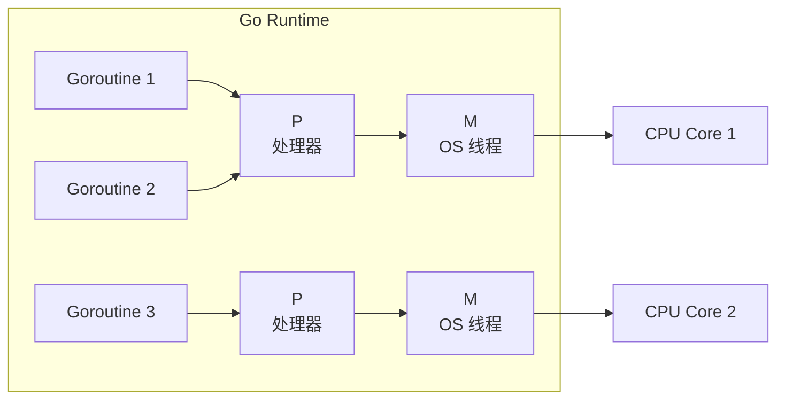

---
tags:
  - Go
title: goroutine 与 channel 并发模型
description: Go 的 CSP 并发模型、goroutine 调度、channel 模式与常见陷阱
date: 2026/05/16
---

# goroutine 与 channel 并发模型

Go 的并发模型基于 **CSP（Communicating Sequential Processes）**——与其通过共享内存通信，不如通过通信共享内存（*Don't communicate by sharing memory; share memory by communicating*）。

本文面向已有 C/C++ 并发经验、想理解 Go 并发方式的读者。

---

## 1. goroutine：比线程更轻的并发单元

goroutine 是 Go runtime 管理的**用户态协程**，而不是操作系统线程：

```go
go func() {
    // 在新 goroutine 里执行
    fmt.Println("hello from goroutine")
}()
```

**goroutine vs 线程：**

| 维度 | goroutine | OS 线程 |
|------|-----------|---------|
| **初始栈** | ~2 KB（动态增长） | 1~8 MB（固定） |
| **调度** | Go runtime（M:N 调度） | 内核（1:1） |
| **创建开销** | 极低（微秒级） | 较高（毫秒级） |
| **上下文切换** | 用户态，快 | 系统调用，慢 |
| **数量** | 可轻松跑几十万个 | 一般最多几千个 |

### 1.1 Go 调度器（GMP 模型）



- **G（Goroutine）**：要执行的任务
- **M（Machine）**：OS 线程，真正执行代码
- **P（Processor）**：调度上下文，持有 runqueue，数量等于 `GOMAXPROCS`（默认 = CPU 核数）

当一个 goroutine 执行**系统调用**（如 I/O）时，M 会被阻塞，P 会迁移到其他 M，继续运行其他 goroutine——这就是 Go 高并发 I/O 的核心机制。

---

## 2. channel：goroutine 间的通信

channel 是**类型安全的消息队列**，用于 goroutine 之间传递数据：

```go
// 创建 channel
ch := make(chan int)        // 无缓冲（同步）
bch := make(chan int, 10)   // 有缓冲（异步，容量 10）

// 发送（阻塞直到有接收方，无缓冲时）
ch <- 42

// 接收（阻塞直到有数据）
v := <-ch

// 关闭（发送方关闭，接收方可继续读已有数据）
close(ch)

// 接收时检查 channel 是否已关闭
v, ok := <-ch
if !ok {
    // channel 已关闭且没有更多数据
}
```

### 2.1 无缓冲 vs 有缓冲

**无缓冲 channel（make(chan T)）**：发送和接收必须同时准备好，相当于**同步握手**：

```go
// 经典用法：等待 goroutine 完成
done := make(chan struct{})

go func() {
    doWork()
    done <- struct{}{}  // 发送，通知完成
}()

<-done  // 阻塞，直到 goroutine 完成
```

**有缓冲 channel（make(chan T, N)）**：缓冲满时才阻塞发送方，相当于**异步队列**：

```go
// 工作池模式
jobs := make(chan Job, 100)   // 最多缓冲 100 个任务

// 生产者
go func() {
    for _, j := range allJobs {
        jobs <- j   // 队列未满时不阻塞
    }
    close(jobs)
}()

// 消费者（多个 worker）
for i := 0; i < numWorkers; i++ {
    go func() {
        for j := range jobs {   // range 在 close 后自动退出
            process(j)
        }
    }()
}
```

### 2.2 select：多路复用

`select` 类似 `switch`，但用于 channel 操作，**随机选择一个可执行的 case**：

```go
select {
case msg := <-ch1:
    fmt.Println("received from ch1:", msg)
case msg := <-ch2:
    fmt.Println("received from ch2:", msg)
case ch3 <- data:
    fmt.Println("sent to ch3")
case <-time.After(5 * time.Second):
    fmt.Println("timeout!")
default:
    fmt.Println("no channel ready, non-blocking")
}
```

**`time.After` 做超时**是 Go 里非常常见的模式。

---

## 3. 常见并发模式

### 3.1 扇出（Fan-out）：一个输入分发给多个 worker

```go
func fanOut(input <-chan Job, numWorkers int) []<-chan Result {
    outputs := make([]<-chan Result, numWorkers)
    for i := 0; i < numWorkers; i++ {
        ch := make(chan Result)
        outputs[i] = ch
        go func() {
            for job := range input {
                ch <- process(job)
            }
            close(ch)
        }()
    }
    return outputs
}
```

### 3.2 扇入（Fan-in）：多个输入合并到一个

```go
func fanIn(inputs ...<-chan Result) <-chan Result {
    merged := make(chan Result)
    var wg sync.WaitGroup
    for _, ch := range inputs {
        wg.Add(1)
        go func(c <-chan Result) {
            defer wg.Done()
            for r := range c {
                merged <- r
            }
        }(ch)
    }
    go func() {
        wg.Wait()
        close(merged)
    }()
    return merged
}
```

### 3.3 Context：级联取消

```go
ctx, cancel := context.WithTimeout(context.Background(), 5*time.Second)
defer cancel()

go func() {
    select {
    case <-ctx.Done():
        // 超时或被主动取消，清理并退出
        return
    case result := <-doWork(ctx):
        // 正常完成
        processResult(result)
    }
}()
```

`context.Context` 是 Go 里取消级联操作的标准方式，大多数库（HTTP client、DB driver 等）都接受 `ctx` 参数。

---

## 4. sync 包：共享内存方式

不是所有并发都适合用 channel，**简单的计数器或临界区**用 `sync` 包更直接：

```go
var mu sync.Mutex
var count int

func increment() {
    mu.Lock()
    count++
    mu.Unlock()
}

// 或用 atomic（更轻量）
var atomicCount int64
atomic.AddInt64(&atomicCount, 1)

// WaitGroup：等待一批 goroutine 完成
var wg sync.WaitGroup
for i := 0; i < 10; i++ {
    wg.Add(1)
    go func(n int) {
        defer wg.Done()
        doWork(n)
    }(i)
}
wg.Wait()
```

---

## 5. 常见陷阱

### 5.1 goroutine 泄漏

goroutine 在 channel 操作处阻塞且没有人会取消它 → 永久泄漏：

```go
// 陷阱：ch 没有人发送，这个 goroutine 永远阻塞
go func() {
    v := <-ch   // 如果没有发送方，这里永远卡着
    process(v)
}()

// 修复：用 context 或超时
go func() {
    select {
    case v := <-ch:
        process(v)
    case <-ctx.Done():
        return   // 上层取消时退出
    }
}()
```

用 `runtime.NumGoroutine()` 或 pprof 监控 goroutine 数量，防止泄漏累积。

### 5.2 向已关闭的 channel 发送 → panic

```go
close(ch)
ch <- 1   // panic: send on closed channel

// 只有发送方才应该 close；关闭一次，多个接收方都会感知到
```

### 5.3 range 遍历 channel 忘记 close

```go
// 消费方用 range
for v := range ch {
    process(v)
}
// range 会阻塞等待，直到 ch 被 close，如果发送方没有 close → 永远阻塞
```

### 5.4 闭包捕获循环变量

```go
// 陷阱：所有 goroutine 共享同一个 i
for i := 0; i < 5; i++ {
    go func() {
        fmt.Println(i)   // 大概率打印 5 5 5 5 5
    }()
}

// 修复：通过参数传入
for i := 0; i < 5; i++ {
    go func(n int) {
        fmt.Println(n)
    }(i)
}
```

---

## 6. 与 C++ 并发的对比

| 维度 | Go goroutine + channel | C++ thread + mutex |
|------|----------------------|-------------------|
| **模型** | CSP，通过通信共享 | 共享内存 + 锁 |
| **创建成本** | 极低 | 较高 |
| **死锁检测** | 运行时 goroutine 泄漏检测（pprof） | 无内置，lockdep（仅内核） |
| **竞态检测** | `go run -race` 内置 | ASan ThreadSanitizer |
| **适合场景** | 高并发 I/O，服务端，工具链 | 数据面，实时，嵌入式 |
| **嵌入式** | 不适合裸机；Linux 用户态可用 | 完整支持 |

---

## 延伸阅读

- [[编程语言/Go/cgo 与交叉编译]]（Go 调用 C 库）
- [[编程语言/C++/C++多线程与多进程编程]]（C++ 侧对比）
- [[编程语言/C++/无锁编程]]（C++ 无锁 vs Go channel 设计哲学对比）
