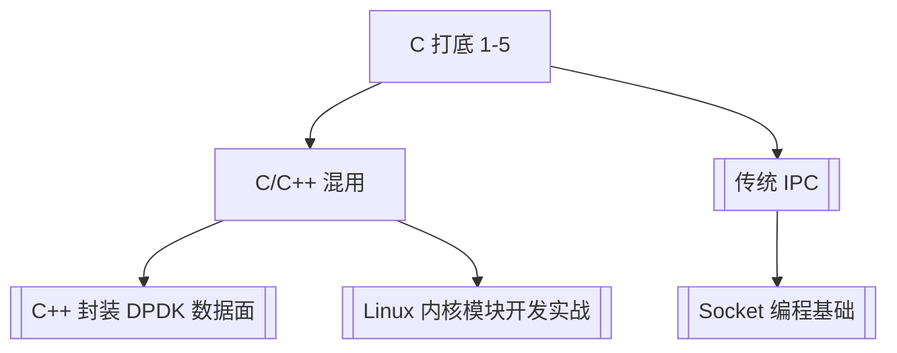

---
tags:
  - C
  - C++
  - 学习路径
title: 精通 C/C++ 学习路径
description: 12 篇主线顺序、阶段目标与复习入口（嵌入式 Linux + DPDK）
date: 2026/05/21
---

# 精通 C/C++ 学习路径

面向 **嵌入式 Linux + DPDK + 系统级 C/C++** 的 **自学顺序**。与 [[成长路径/index#八点五、精通 C / C++（系统向主线）]] 对齐；单篇深度文分散在 [[编程语言/C/index|C]] 与 [[编程语言/C++/index|C++]] 目录。

---

## 1. 阶段总览

| 阶段 | 目标 | 篇数 |
|------|------|------|
| **1. C 打底** | 内存、链接、I/O、标准特性 | 5 |
| **2. 边界与工程** | C/C++ 混用、规范、读源码 | 3 |
| **3. C++ 机制** | 对象模型、ABI、分配器、C++20 决策 | 4 |
| **4. 测对写快** | Sanitizer、单测、性能 | 2（穿插全程） |

---

## 2. 推荐阅读顺序（12 篇）

### 阶段 1：C 打底

| # | 文章 | 带走什么 |
|---|------|----------|
| 1 | [[C 内存模型与未定义行为]] | 栈堆、指针、UB Top10 |
| 2 | [[C 编译链接与 ABI]] | 符号、静态/动态链接、交叉编译 |
| 3 | [[C 字符串与 POSIX I/O 精读]] | read/write、mmap、长度前缀 |
| 4 | [[C99-C11 实用特性]] | 指定初始化、FAM、`_Generic` |
| 5 | [[linux/内核机制/传统 IPC：System V 与 POSIX|传统 IPC]] | 管道、msg/shm/sem |

### 阶段 2：边界与工程

| # | 文章 | 带走什么 |
|---|------|----------|
| 6 | [[C 与 C++ 混用]] | `extern "C"`、所有权、回调 |
| 7 | [[MISRA C 与 CERT C 编码规范对照]] | Review + 静态分析 |
| 8 | [[阅读 C 与 C++ 源码的方法]] | glibc、内核、DPDK 怎么读 |

### 阶段 3：C++ 机制

| # | 文章 | 带走什么 |
|---|------|----------|
| 9 | [[RAII]] → [[C++ 对象模型与 Rule of Zero-Three-Five]] | Rule of 0/3/5、移动 |
| 10 | [[C++ ABI 深读]] | vtable、mangling、coredump |
| 11 | [[PMR 与自定义分配器]] | arena vs rte_mempool |
| 12 | [[C++20 协程与 Modules 选用决策]] | 嵌入式/DPDK 用不用 |

### 阶段 4：测对写快（与 9 后并行）

| # | 文章 | 带走什么 |
|---|------|----------|
| — | [[C/C++ Sanitizer 与单元测试入门]] | ASan/UBSan、GoogleTest |
| — | [[C/C++ 性能优化方法论]] | perf、cache、绑核 |

**C++ 标准语法**：[[C++ 关键新特性]]（11/17/20）作 **词典**，不必线性读完。

---

## 3. 与 DPDK / 内核的衔接

| 方向 | 学完 C/C++ 主线后 |
|------|-------------------|
| **DPDK** | [[网络与DPDK/教程/index]] + [[多 worker 与 mempool 并发假设]] |
| **驱动** | [[linux/学习路径/字符设备驱动入门]] |
| **调试** | [[系统调试/排障 SOP：日志、perf 与反汇编]] |

---

## 4. 实践验收（自测）

每阶段结束做一次 **小练习**，不必全做：

| 阶段 | 练习 |
|------|------|
| 1 | 写 `read_full`/`write_full` + 长度前缀 echo；`readelf` 读交叉编译产物 → [[C/C++ 主线实践验收]] |
| 2 | 用 `extern "C"` 包一层 DPDK init；Review 自己代码对照 MISRA 10 条 → [[C/C++ 主线实践验收#3. 阶段 2：C/C++ 边界 + 规范 Review]] |
| 3 | 实现 Rule-of-5 的 fd RAII；`nm -C` 看虚类符号 → [[C/C++ 主线实践验收#4. 阶段 3：C++ 对象模型 + ABI 符号]] |
| 4 | 开 ASan 跑单测；perf 火焰图找一热点 → [[C/C++ 主线实践验收#5. 阶段 4：测对 + 写快]] |

算法与数据结构：[[排序算法大全与 C++ 实现]]、本地 leetcode（不纳入本站）。

---

## 5. 疑问怎么记

零散问题一行一条 → [[学习疑问/疑问记录]]，解答后回链 **已解**。

---

## 6. 相关入口

- [[编程语言/index]]
- [[成长路径/index]]
- [[工程基础/设计模式]]（与 C++ 并行，非主线必需）

---

*本页随 [[成长路径/index]] §8.5 更新；新增专题优先写入 C/C++ 子目录再回链此处。*
