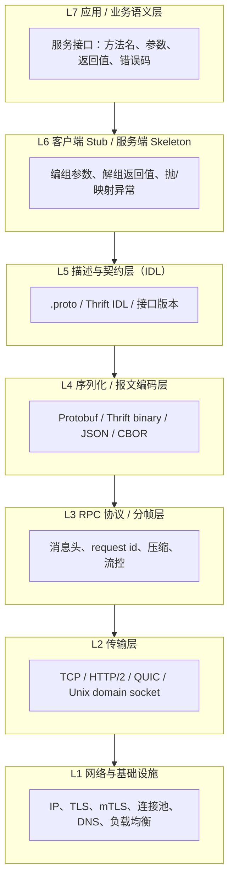
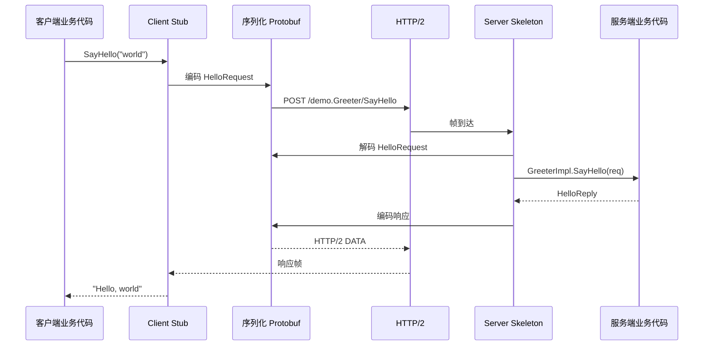

---
tags:
  - RPC
  - 网络
  - gRPC
title: RPC 技术与分层详解
description: 远程过程调用的分层模型、序列化、传输与工程实践，及与数据面/嵌入式场景的边界
date: 2026/05/18
---

# RPC 技术与分层详解

**RPC（Remote Procedure Call，远程过程调用）** 的目标是：让调用方像调用本地函数一样，触发远端进程中的逻辑并拿到结果。听起来简单，真正落地时要同时解决 **地址空间隔离、网络不可靠、版本演进、安全与性能** 等问题，因此业界普遍用 **分层** 把职责拆开。

本文从 **概念 → 分层模型 → 一次完整调用 → 常见框架映射 → 工程陷阱 → 与本站主线（DPDK / 嵌入式）的关系** 串起来，便于选型与排障。

---

## 1. 本地调用 vs 远程调用

本地函数调用（以 C 为例）大致是：

1. 调用方把参数压栈或放入寄存器；
2. `call` 跳转到函数入口；
3. 被调方执行，返回值写回寄存器或内存；
4. 控制流回到调用方。

这一切发生在 **同一地址空间、同一台机器**，指针可以直接传递，失败模式主要是程序错误（段错误等）。

远程调用则多出一整段 **「跨进程 / 跨主机」** 路径：

| 维度 | 本地调用 | RPC |
|------|----------|-----|
| 地址空间 | 共享 | 隔离 |
| 参数传递 | 指针 / 结构体地址 | 必须 **序列化** 为字节流 |
| 失败 | 同步、可预测 | 超时、丢包、对端宕机、版本不兼容 |
| 性能 | 纳秒～微秒级 | 通常 **毫秒级** 起（局域网可更低） |
| 语义 | 精确一次执行 | 至多一次 / 至少一次 / 恰好一次 需额外设计 |

RPC **并不** 保证与本地调用完全相同的语义；框架提供的是 **「近似本地调用」的开发体验**，可靠性由 **超时、重试、幂等、熔断** 等模式补齐。

---

## 2. 为什么要分层

如果把序列化、协议、连接、鉴权、服务发现全写在一个函数里，会出现：

- 换传输（TCP → QUIC）要改业务代码；
- 换序列化（JSON → Protobuf）牵动全网客户端；
- 测试困难，无法单独 mock 某一层。

分层后每一层只关心 **上下邻层的契约（contract）**，与 OSI / TCP/IP 的思想类似，但 RPC 栈是 **应用导向** 的，各实现命名不完全统一。下面给出一套 **实践中常用、与 gRPC / Thrift 等对齐** 的分层模型。

---

## 3. RPC 分层模型（自顶向下）



> 说明：层号仅为讲解方便，不同教材编号可能不同；关键是 **职责边界**。

### 3.1 L7 — 应用 / 业务语义层

定义 **「能调什么」**：

- 服务名：`UserService`、`/v1/order/create`（REST 风格 RPC 也常见）；
- 方法：`GetUser(id) -> User`；
- **业务错误** vs **传输错误**：例如 `UserNotFound` 是正常业务响应还是应 retry 的 503。

这一层通常由 **产品接口文档 + IDL 生成代码** 共同表达。

### 3.2 L6 — Stub / Skeleton（客户端桩与服务端骨架）

**Stub（客户端）** 负责：

- 把语言层面的参数（对象、结构体）交给下层序列化；
- 阻塞或异步等待响应；
- 把字节流还原为返回值或异常。

**Skeleton（服务端）** 负责：

- 收包、反序列化；
- 分发到真正的业务实现（你写的 `ServiceImpl`）；
- 把结果或错误编码回去。

手写 Stub 繁琐，因此现代框架几乎都做 **代码生成**（Protobuf Compiler + gRPC plugin 等）。

### 3.3 L5 — 描述与契约层（IDL）

**IDL（Interface Definition Language）** 描述接口，与具体语言解耦：

```protobuf
syntax = "proto3";
package demo;

service Greeter {
  rpc SayHello (HelloRequest) returns (HelloReply);
}

message HelloRequest { string name = 1; }
message HelloReply   { string message = 1; }
```

契约层解决：

- **字段编号** 与向后兼容（只增字段、不改号）；
- **多语言** 同一份 `.proto` 生成 C++ / Go / Python；
- **版本**（package、`v1`/`v2` API 路径）。

没有 IDL 时也可用 **OpenAPI + JSON**，但类型安全与演进规则需团队自行约束。

### 3.4 L4 — 序列化 / 报文编码层

把内存中的数据结构变为 **字节序列**（marshal），反之 unmarshal。

| 格式 | 特点 | 典型场景 |
|------|------|----------|
| **Protocol Buffers** | 紧凑、快、需 schema | gRPC 默认 |
| **Thrift binary** | 紧凑、跨语言 | 早期分布式服务 |
| **JSON / MessagePack** | 可读、体积大 | 调试、浏览器、脚本 |
| **FlatBuffers / Cap'n Proto** | 少拷贝、适合嵌入式读 | 游戏、部分 MCU 网关 |
| **XDR**（Sun RPC） | 历史格式 | NFS 等老系统 |

选型权衡：**体积、CPU、schema 刚性、是否支持流式字段**。

### 3.5 L3 — RPC 协议 / 分帧层

在 TCP 字节流之上，必须回答：

- 一条消息从哪到哪（** framing**）；
- 如何关联请求与响应（**correlation id**）；
- 是否支持 **单向调用、流式、双向流**。

示例概念（非某一实现的精确格式）：

```
[ magic | version | flags | length | request_id | payload... ]
```

**gRPC** 在 HTTP/2 之上用 **HEADERS + DATA** 帧承载上述信息，并天然支持 **多路复用**（一个 TCP 连接上并发多个 RPC）。

**JSON-RPC 2.0** 则用 JSON 对象里的 `"id"` 字段关联。

### 3.6 L2 — 传输层

承载字节流的通道：

| 传输 | 优点 | 注意点 |
|------|------|--------|
| **TCP** | 可靠、有序 | 队头阻塞；需自建连接池 |
| **HTTP/2** | 多路复用、与网关友好 | 中间盒、调试工具成熟 |
| **QUIC/HTTP/3** | 连接迁移、低握手延迟 | 栈与运维复杂度 |
| **Unix domain socket** | 同机极低延迟 | 仅本机 |
| **RDMA**（verbs） | 极低延迟、旁路 CPU | 见 [[网络与DPDK/实践/RDMA 适用场景速览]]，编程模型非传统 RPC |

RPC 框架常 **不绑定** 单一传输：例如 gRPC 支持 `insecure` TCP、`grpcs`（TLS）、xDS 负载均衡等。

### 3.7 L1 — 网络与基础设施层

再往下就是 **IP、路由、防火墙、TLS/mTLS、服务发现、负载均衡、可观测性**：

- **服务发现**：Consul、etcd、Kubernetes DNS（共识与选主见 [[分布式系统/共识算法/分布式共识算法概览]]）；
- **负载均衡**：客户端 LB（gRPC pick_first / round_robin）、L7 代理（Envoy）；
- **安全**：TLS 加密、证书轮换、mTLS 双向认证；
- **可观测**：trace id 注入（OpenTelemetry）、metrics、access log。

这一层往往由 **平台团队** 统一提供，业务 RPC 只需配置目标地址或 resolver。

---

## 4. 一次同步 RPC 的端到端流程

以 **gRPC 同步 Unary RPC** 为例：



关键观察：

1. **业务只碰 Stub**，不直接操作 socket；
2. **阻塞发生在 Stub 内部**（同步 API），底层可能是 epoll + HTTP/2 状态机；
3. 任意一层失败都会向上表现为 **status code**（如 `UNAVAILABLE`、`DEADLINE_EXCEEDED`）。

---

## 5. 调用语义：不止「请求-响应」

| 模式 | 说明 | 典型 API |
|------|------|----------|
| **Unary** | 一问一答 | 普通 `rpc Get()` |
| **Server streaming** | 客户端一个请求，服务端多条响应 | 拉日志、订阅 |
| **Client streaming** | 客户端多条，服务端一个汇总响应 | 上传分片 |
| **Bidirectional streaming** | 双向流 | 实时协作、部分游戏同步 |

流式 RPC 在 **L3/L2** 上通常复用同一条 HTTP/2 流，分帧多次 DATA，应用层用 **iterator / async read** 消费。

---

## 6. 与「REST + JSON」的对比

REST 常被称作「资源导向」，RPC 是 **「过程 / 方法导向」**：

| 项 | REST over HTTP | RPC（如 gRPC） |
|----|----------------|----------------|
| 抽象 | 资源 + HTTP 动词 | 服务 + 方法 |
| 契约 | OpenAPI（可选） | IDL（强） |
| 负载 | 多为 JSON | 多为 Protobuf |
| 浏览器 | 友好 | 需 gRPC-Web 等 |
| 缓存 | HTTP 缓存语义清晰 | 一般不缓存 RPC 结果 |
| 网关 | 成熟 | 需支持 HTTP/2 或 grpc-gateway |

二者可共存：对外 REST，对内 gRPC；用 **grpc-gateway** 把 REST 映射到同一 Stub。

---

## 7. 可靠性：分层视角下的横切 concern

以下问题 **不单独占一层**，但必须在设计中明确：

### 7.1 超时（Deadline）

从 Stub 发起时带上 **deadline**，各 hop 递减，避免级联堆积。gRPC 中 `context deadline` 会编码进 metadata。

### 7.2 重试与幂等

网络闪断时 **自动重试** 可能导致 **重复执行**（如扣款两次）。约定：

- **只读** 接口可安全重试；
- **写操作** 需 **幂等键**（idempotency key）或服务端去重表。

### 7.3 错误分类

| 类型 | 示例 | 客户端策略 |
|------|------|------------|
| 业务错误 | 用户不存在 | 展示给用户，不重试 |
| 可重试传输错误 | `UNAVAILABLE` | 指数退避重试 |
| 不可重试 | `INVALID_ARGUMENT` | 修参数 |

### 7.4 熔断与限流

连续失败时 **熔断**（circuit breaker），保护下游；与 [[系统调试/线程池技术详解]] 中的过载保护思想一致，只是作用在 **跨进程** 边界。

### 7.5 版本与兼容

- **IDL 层**：只增字段、不改 tag；废弃用 `reserved`；
- **部署层**：蓝绿 / 金丝雀，同时跑 v1/v2 服务端；
- **客户端**：旧客户端连新服务端，未知字段应 **忽略**（Protobuf 默认行为）。

---

## 8. 常见实现映射表

| 框架 / 标准 | IDL | 序列化 | 传输 | 备注 |
|-------------|-----|--------|------|------|
| **gRPC** | Protobuf | Protobuf | HTTP/2（主流） | 云原生事实标准之一 |
| **Apache Thrift** | Thrift IDL | binary / compact / JSON | TCP / HTTP 等 | 多语言、可自选 stack |
| **JSON-RPC 2.0** | 无（约定方法名） | JSON | HTTP / WebSocket / TCP | 简单、轻量 |
| **Apache Avro + RPC** | Avro schema | Avro | 常配合 Kafka | 数据管道更多 |
| **Cap'n Proto RPC** | Cap'n Proto | 自身 | 通常 TCP | 少拷贝 |
| **Sun ONC RPC** | xdrgen | XDR | UDP/TCP | 老 Unix / NFS |
| **Windows DCOM / .NET Remoting** | 类型库 | 二进制 | 多种 | 微软生态 |
| **DBus** | XML introspection | 二进制 | Unix socket | **本机 IPC**，见下文 |

---

## 9. 嵌入式与边缘场景

本站主线是 **嵌入式 Linux + DPDK 数据面**，RPC 通常出现在 **控制面 / 管理面**，而非线速转发路径：

| 场景 | 常见选择 | 说明 |
|------|----------|------|
| 设备 ↔ 云端 | MQTT + JSON、HTTPS REST、gRPC | MQTT **不是 RPC**（发布订阅），但与「远程命令」常混用 |
| 车载 / 域控 | **SOME/IP**（AUTOSAR） | 服务发现 + RPC 语义，与 IT 侧 gRPC 不同栈 |
| 板内进程通信 | **DBus**、Unix socket + 自定义帧、共享内存 | 延迟低，不必上 TCP |
| 网关协议转换 | 南向 Modbus / CAN，北向 gRPC/REST | RPC 在 northbound |

**DPDK 数据面** 处理的是 **报文转发**（L2～L4 用户态），与 **gRPC 控制信令** 分工明确：参见 [[网络与DPDK/实践/与内核网络栈共存]]、[[linux/内核机制/Linux 内核网络栈与 DPDK 适用边界]]。

资源受限设备选型建议：

- 优先 **精简栈**：Unix socket + Protobuf（无 HTTP/2）或 **nanopb + 自定义 framing**；
- 慎用 **反射、流式、大消息**；
- TLS 用 **mbedTLS** 等嵌入式库，注意握手 CPU 开销。

---

## 10. 性能与调试要点

1. **序列化成本**：Profiling 时区分 **Protobuf encode** vs **业务逻辑**；大字段考虑 `bytes` 分片或侧路传文件。
2. **连接复用**：避免每次 RPC 新建 TCP；gRPC channel 应 **长生命周期**。
3. **消息大小**：默认 4MB 上限可调；超大 payload 用 **流式** 或对象存储预签名 URL。
4. **CPU 与 NUMA**：服务端线程与网卡中断 **同 NUMA** 绑核，与 [[网络与DPDK/实践/DPDK 性能剖析与绑核 checklist]] 同源思路。
5. **排障工具**：`grpcurl`、`tcpdump`、Envoy access log、OpenTelemetry trace；应用层日志打印 **request_id**。

---

## 11. 设计 checklist（写接口前自问）

- [ ] 接口是 **幂等** 的吗？重试策略是什么？
- [ ] **超时** 设多少？是否传递到下游？
- [ ] IDL 字段是否 **只增不改**？默认值是否合理？
- [ ] 错误码是否区分 **业务 / 基础设施**？
- [ ] 是否需要 **流式**（大列表、实时数据）？
- [ ] 安全：是否 **mTLS**？元数据里是否误传敏感信息？
- [ ] 观测：是否有 **trace id** 贯穿日志？

---

## 12. 小结

| 层 | 核心问题 | 典型技术 |
|----|----------|----------|
| L7 业务 | 调什么、错误语义 | 领域模型、错误码表 |
| L6 Stub/Skeleton | 如何像本地函数一样写 | gRPC generated code |
| L5 IDL | 契约与演进 | `.proto`、Thrift IDL |
| L4 序列化 | 对象 ↔ 字节 | Protobuf、JSON |
| L3 RPC 协议 | 分帧、关联、流 | gRPC over HTTP/2 |
| L2 传输 | 可靠送达 | TCP、QUIC |
| L1 基础设施 | 发现、安全、负载 | K8s、Envoy、TLS |

RPC 的价值在于 **用分层换可演进性**；代价是 **分布式复杂度**（超时、一致性、版本）无法被框架完全隐藏，仍需在 L7 业务层显式建模。

---

## 延伸阅读

- [[linux/内核机制/Linux 内核网络栈与 DPDK 适用边界]] — 控制面 RPC 与数据面 DPDK 分工
- [[网络与DPDK/实践/与内核网络栈共存]] — 管理口跑 RPC、数据口跑 DPDK
- [[网络与DPDK/实践/RDMA 适用场景速览]] — 极低延迟场景的另一条路
- [[编程语言/Go/goroutine 与 channel 并发模型]] — 异步 RPC 服务端常结合 goroutine 池
- [[编程语言/C++/C++多线程与多进程编程]] — C++ 服务端线程模型
