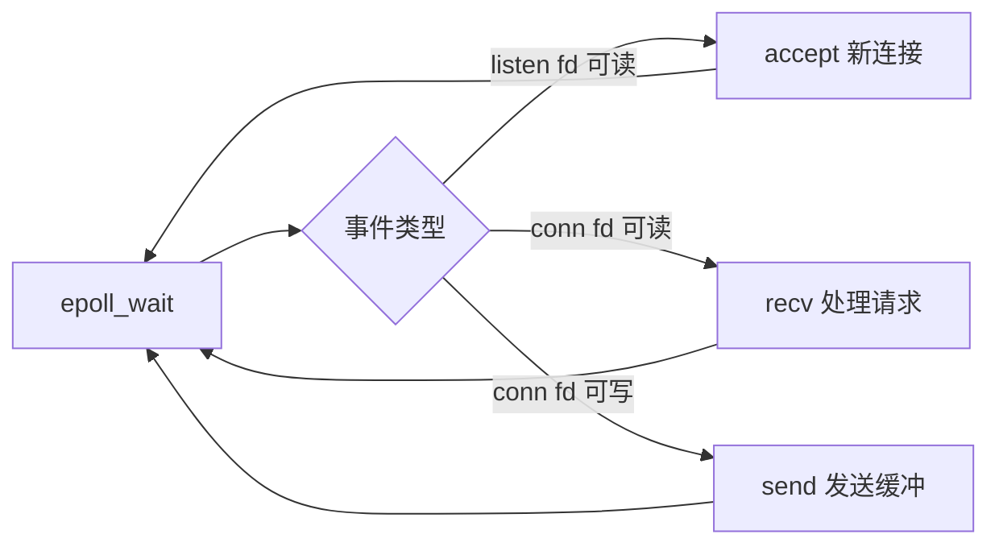

---
tags:
  - 网络编程
  - epoll
  - 并发
title: IO 多路复用：select、poll、epoll 与并发模型
description: select poll epoll 差异、边缘触发、Reactor 与线程池服务器骨架
date: 2026/05/21
---

# IO 多路复用：select、poll、epoll 与并发模型

本文是 [[网络与DPDK/网络编程/index|Linux 网络编程]] 第二篇：在 **单线程或少量线程** 内同时监视 **多个 socket** 是否可读/可写，从而支撑 **C10K** 级别的并发连接（仍走内核协议栈）。

---

## 1. 为什么需要多路复用

阻塞模型下 **一线程一连接**：

- 1000 连接 ≈ 1000 线程 → 栈内存、调度开销巨大。
- 大量线程阻塞在 `recv`，CPU 空转在上下文切换上。

**IO 多路复用**：线程在 `epoll_wait`（等）上睡眠，**仅当某个 fd 就绪** 再 `recv`/`send`，用 **少量线程** 服务 **大量空闲连接**。

---

## 2. select / poll / epoll 对比

| 机制 | 就绪通知 | 最大 fd 数 | 每次调用开销 | Linux 现状 |
|------|----------|------------|--------------|------------|
| `select` | `fd_set` 位图 | 通常 1024（`FD_SETSIZE`） | O(n) 扫描全集 | 遗留、可移植 |
| `poll` | `pollfd` 数组 | 无硬上限（受内存） | O(n) | 可移植 |
| `epoll` | 内核红黑树 + 就绪链表 | 大 | O(就绪数) | **Linux 服务端首选** |
| `io_uring` | 共享环、异步提交 | 大 | 更低拷贝/系统调用 | 新项目可评估 |

> **epoll 仅 Linux**；跨平台常用 `poll` 或库（libuv、Boost.Asio）封装。

### 2.1 epoll 三个 API

```c
int epfd = epoll_create1(0);
struct epoll_event ev = { .events = EPOLLIN, .data.fd = listen_fd };
epoll_ctl(epfd, EPOLL_CTL_ADD, listen_fd, &ev);

struct epoll_event events[64];
int n = epoll_wait(epfd, events, 64, -1);
for (int i = 0; i < n; i++) {
    int fd = events[i].data.fd;
    /* 可读/可写/错误 分支处理 */
}
```

- `EPOLL_CTL_ADD` / `MOD` / `DEL` 维护兴趣列表。
- `data` 可存 **fd 指针或自定义结构**，便于回调。

### 2.2 水平触发（LT）vs 边缘触发（ET）

| 模式 | 行为 | 注意 |
|------|------|------|
| **LT**（默认） | 只要缓冲区仍有数据，每次 `wait` 都报告可读 | 不易漏事件，可能重复唤醒 |
| **ET** | 仅 **状态变化** 时通知一次 | 必须 **非阻塞 fd** + **循环读尽** |

ET 可减少唤醒次数，但代码要求更严；初学者建议 **LT + 非阻塞** 或 **LT + 阻塞** 小项目。

---

## 3. 典型 Reactor 事件循环



**Reactor**：IO 就绪 → 当前线程（或线程池）**同步** 处理。

与 **Proactor**（Windows IOCP、部分 io_uring 用法）相对：由 OS 完成 IO 再通知完成事件。

---

## 4. 单线程 epoll 服务器骨架

```c
void set_nonblock(int fd) {
    int fl = fcntl(fd, F_GETFL, 0);
    fcntl(fd, F_SETFL, fl | O_NONBLOCK);
}

/* 1. listen_fd 加入 epoll
 * 2. loop:
 *      n = epoll_wait(...)
 *      for each event:
 *        if fd == listen_fd -> accept, 新 conn 设非阻塞并 EPOLL_CTL_ADD
 *        else if EPOLLIN -> 循环 recv 直到 EAGAIN；若 0 则关闭并 DEL
 *        else if EPOLLOUT -> 发送写缓冲
 */
```

**新连接** 务必：

1. `set_nonblock(conn)`；
2. `epoll_ctl(ADD, conn, EPOLLIN | EPOLLET)`（若用 ET）。

---

## 5. 并发模型选型

| 模型 | 结构 | 适用 |
|------|------|------|
| **单 Reactor 单线程** | 一个 `epoll_wait` + 业务 | 连接少、逻辑轻 |
| **单 Reactor 多线程** | IO 线程 `epoll` + 任务队列给 worker | 业务重、需隔离 |
| **多 Reactor** | 每核一个 `epoll` + `SO_REUSEPORT` | 多核扩展 |
| **每连接一线程** | 简单，难扩展 | 原型、< 百连接 |

与 DPDK **每 lcore 一个 poll 循环** 类似，都是 **避免跨核抢锁**，但 DPDK 不经过内核协议栈（见 [[网络与DPDK/实践/多 worker 与 mempool 并发假设]]）。

Go 的 **netpoller** 在 runtime 内用 epoll（Linux）把 goroutine 与 fd 结合，见 [[编程语言/Go/goroutine 与 channel 并发模型]]。

---

## 6. 写路径与 EPOLLOUT

连接可写缓冲满时 `send` 返回 `EAGAIN`：

1. 将待发数据放入 **每连接写队列**；
2. `epoll_ctl(MOD, EPOLLIN | EPOLLOUT)`；
3. `EPOLLOUT` 触发时继续 `send`，发完后 **去掉 EPOLLOUT** 避免 busy loop。

这是 epoll 服务器 **最容易写漏** 的部分。

---

## 7. io_uring 简注

Linux 5.1+ 的 **io_uring** 通过 mmap 环提交 `accept`/`recv`/`send`，减少系统调用次数，可与 epoll **并存或替代**（liburing）。

嵌入式 / 网关若内核较新，可评估；否则 **epoll 仍是文档与案例最丰富** 的选择。

---

## 8. 常见坑

| 现象 | 原因 |
|------|------|
| ET 下丢数据 | 未循环读到 `EAGAIN` |
| CPU 100% | `EPOLLOUT` 未关闭、空转 `epoll_wait(0)` |
| 连接泄漏 | `recv==0` 未 `epoll_ctl(DEL)` + `close` |
| 惊群 | 多进程 `accept` 同一 listen（用 `SO_REUSEPORT` 或单进程 accept） |

---

## 延伸阅读

- [[Socket 编程基础：TCP、UDP 与字节序]]
- [[TCP 连接、粘包与常见陷阱]]
- [[编程语言/C++/C++多线程与多进程编程]]
- [[linux/内核机制/进程调度与绑核]]
