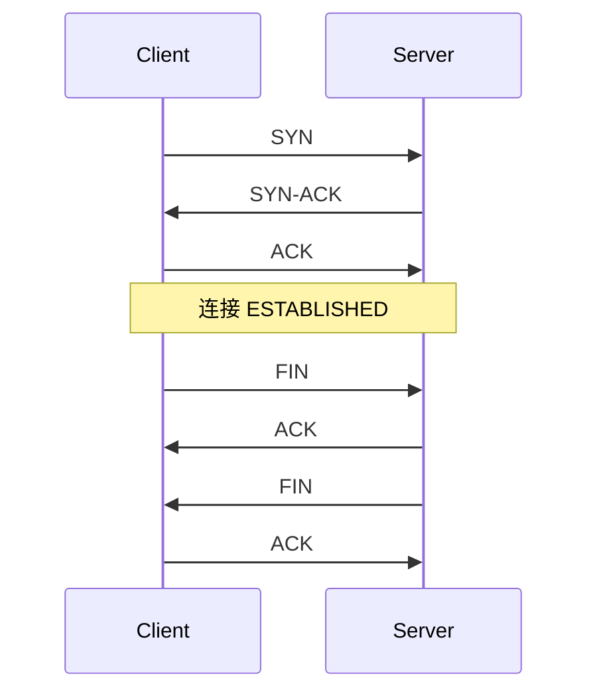

---
tags:
  - 网络编程
  - TCP
title: TCP 连接、粘包与常见陷阱
description: 三次握手、TCP 状态、粘包半包、Nagle、TIME_WAIT 与调试
date: 2026/05/16
---

# TCP 连接、粘包与常见陷阱

本文是 [[网络与DPDK/网络编程/index|Linux 网络编程]] 第三篇：TCP 既是 **可靠字节流**，又不是 **消息边界**——理解这一点才能写好 Socket 程序。

---

## 1. 三次握手与四次挥手（复习）



- **三次握手**：同步初始序号、协商窗口；防旧连接干扰。
- **四次挥手**：全双工关闭，可能 **TIME_WAIT**（主动关闭方保留 2MSL）。

应用层 `connect` / `accept` 成功时，内核已完成握手；你 **看不到** SYN 包，除非 `tcpdump`。

---

## 2. TCP 是字节流，不是消息流

`send` 三次各 100 字节，对端可能：

- 一次 `recv` 300 字节（**粘包**）；
- 三次各 100 字节；
- 两次 150 + 150。

**必须在应用层定义消息边界**，常见方案：

| 方案 | 做法 |
|------|------|
| **固定长度** | 每条记录 N 字节 |
| **长度前缀** | `uint32_t len` + payload（网络字节序） |
| **分隔符** | `\n`、`\0`（需转义） |
| **文本协议** | HTTP header `Content-Length`、chunk |

示例（长度前缀）：

```c
/* 发送 */
uint32_t len = htonl((uint32_t)payload_len);
send(fd, &len, 4, 0);
send(fd, payload, payload_len, 0);

/* 接收：先读满 4 字节，再按 len 读满 body（循环 recv） */
```

---

## 3. 半包与读满循环

`recv` 返回 **当前可用** 字节数，不保证等于请求长度。生产代码模式：

```c
ssize_t readn(int fd, void *buf, size_t n) {
    size_t left = n;
    char *p = buf;
    while (left > 0) {
        ssize_t r = recv(fd, p, left, 0);
        if (r == 0) return 0;          /* EOF */
        if (r < 0) {
            if (errno == EINTR) continue;
            return -1;
        }
        left -= r;
        p += r;
    }
    return (ssize_t)n;
}
```

非阻塞 + epoll 时，**单次 `recv` 未读尽** 应保留 **读状态机**（已收 2 字节头，还差 2 字节等）。

---

## 4. 常见 TCP 状态（排障用）

`ss -tan` 或 `netstat -tan`：

| 状态 | 含义 |
|------|------|
| `LISTEN` | 服务端等待连接 |
| `ESTABLISHED` | 数据传输中 |
| `TIME_WAIT` | 本端主动关闭后等待 |
| `CLOSE_WAIT` | 对端已关，本端未 `close`（**应用 bug**） |
| `SYN_SENT` / `SYN_RECV` | 握手进行中 |

**大量 `CLOSE_WAIT`**：检查是否忘记 `close(conn)`。  
**大量 `TIME_WAIT`**：短连接频繁；可用 `SO_REUSEADDR`、连接池、或让客户端主动关闭策略优化。

---

## 5. Nagle 与延迟

**Nagle 算法**：小报文合并再发，减少小包数量。  
交互式协议（SSH、游戏）常设：

```c
int on = 1;
setsockopt(fd, IPPROTO_TCP, TCP_NODELAY, &on, sizeof(on));
```

与 [[Socket 编程基础：TCP、UDP 与字节序]] 中的 `TCP_NODELAY` 呼应。

---

## 6.  backlog 与 accept 队列

```c
listen(fd, backlog);
```

- `backlog` 与内核 **`somaxconn`**、`tcp_max_syn_backlog` 等共同限制 **已完成握手、待 accept** 的连接数。
- 队列满时新 SYN 可能被丢弃或重传，表现为 **连接超时**。

高并发服务需调大系统参数并配合 `SO_REUSEPORT` 多进程 accept。

---

## 7. 优雅关闭

```c
shutdown(fd, SHUT_WR);   /* 发送 FIN，仍可 recv */
/* 读完剩余数据 */
close(fd);
```

直接 `close` 也可能发 FIN，但 **半关闭** 更利于协议收尾（如告诉对端「我不再发，但仍可收你的结束帧」）。

---

## 8. 与内核/DPDK 的对比

| 问题 | Socket + TCP | DPDK 自建 |
|------|--------------|-----------|
| 可靠有序 | 内核保证 | 需自实现或仅用 L2/L3 |
| 粘包 | 应用层 framing | 帧结构自定 |
| 调试 | `ss`、`tcpdump` 成熟 | 需 DPDK dump / 硬件计数 |

控制面、配置、OTA 等 **仍推荐 TCP**；线速转发见 [[网络与DPDK/教程/index]]。

---

## 9. 调试 checklist

- [ ] `tcpdump -i any host x.x.x.x and port n`
- [ ] `ss -ti` 看 cwnd、rtt（需 root）
- [ ] 应用日志打印 **实际 recv 长度** 与状态机阶段
- [ ] 确认 **长度字段** 使用 `htonl` / `ntohl`

---

## 延伸阅读

- [[Socket 编程基础：TCP、UDP 与字节序]]
- [[IO 多路复用：select、poll、epoll 与并发模型]]
- [[网络与DPDK/实践/RPC 技术与分层详解]] — 建立在 TCP 之上的 RPC
- [[linux/内核机制/Linux 内核网络栈与 DPDK 适用边界]]
